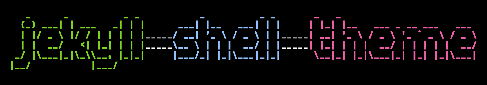

<<<<<<< HEAD


# jekyll-shell-theme

**Jekyll Shell Theme** is a light-weight customizable one-column jekyll theme that gives off:

- Hackery Vibes
- Shell Nostalgia
- Code, code and more code

See an example of this theme in action on the [theme's official site](https://tareqdandachi.github.io/jekyll-shell-theme).

## Installation

### Gem-based method

Add this line to your Jekyll site's `Gemfile`:

```ruby
gem "jekyll-shell-theme"
```

And add this line to your Jekyll site's `_config.yml`:

```yaml
theme: jekyll-shell-theme
```

And then execute:

    $ bundle

Or install it yourself as:

    $ gem install jekyll-shell-theme

### Remote theme method

Make sure your `Gemfile` contains the `github-pages` gem and **not** the `jekyll-shell-theme` gem.

Then add `remote_theme: "tareqdandachi/jekyll-shell-theme"` to your `_config.yml` file.
*Remove* any other `theme:` or `remote_theme:` entry.

*For an example of what a config file could look like, look at [example-config.yml](https://github.com/tareqdandachi/jekyll-shell-theme/blob/master/example-config.yml)*

## Usage

TODO: Write usage instructions here. Describe your available layouts, includes, sass and/or assets.

## Contributing

Bug reports and pull requests are welcome on GitHub at https://github.com/tareqdandachi/jekyll-shell-theme. This project is intended to be a safe, welcoming space for collaboration, and contributors are expected to adhere to the [Contributor Covenant](http://contributor-covenant.org) code of conduct.

## Development

Everyone is welcome to fork this repo and modify the code. To set up your environment to develop this theme, run `bundle install`.

To test the theme, run `bundle exec jekyll serve` and open your browser at `http://localhost:4000`. This starts a Jekyll server using the theme. Add pages, documents, data, etc. like normal to test the theme's contents. As you make modifications to your theme and to your content, your site will regenerate and you should see the changes in the browser after a refresh, just like normal.

When your theme is released, only the files in `_layouts`, `_includes`, `_sass` and `assets` tracked with Git will be bundled.
To add a custom directory to your theme-gem, please edit the regexp in `jekyll-shell-theme.gemspec` accordingly.

## License

The theme is available as open source under the terms of the [MIT License](https://opensource.org/licenses/MIT).
=======
##### ***CURRÍCULUM VITAE***
### Andoni Arnedo Ostiz

- Dirección: Av. de la Santa Paz nº75
- Localidad - CP: Cádiz (31520), Andalucía
- Fecha nacimiento: 16/06/1936
- Teléfono: **92566781**
- Correo electrónico: *galinier91@gmail.com*
##### ACADEMIC TRAINING
- 2019/2020 **CFGS Desarrollo de Aplicaciones Multiplataforma**
*IES Tubalcaín. Tarazona (Zaragoza). 1st course*
- 2017/2019 **Bachillerato de Ciencias y Tecnólogia**
*IES Valle del Ebro. Tudela (Navarra)*
##### FURTHER TRAINING
- 2019/2019 **Prevention of occupational hazards**
*IES Tubalcaín. Tarazona (Zaragoza). 30 hours*
##### LANGUAGES
- **English**: Intermediate level
- **French**: Intermediate level
##### COMPUTING
- Office 
    - Microsoft Word
    - Microsoft Excel
    - Microsoft Powerpoint
- Audio
    - Audacity
- Markup language
    - HTML
    - XML
    - CSS
    - XSD
- Windows interface
- Internet and social networks
- Programming with 
    - Java
    - C#
- Basic in Computer systems
##### PERSONAL COMPETENCES
- Teamwork
- Involvement in projects
- Resistance to work under preassure
- Assertiveness
- Leadership
- Speed and good organization of work
- Help to teammate
- Responsability

##### OTHER DATA OF INTEREST
- Immediate availability
- Driver's license B1
- Own car 


>>>>>>> 787b4908927a41a0124af7fc6bd1354089e09a8e
